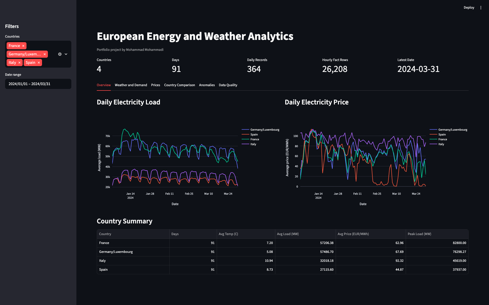
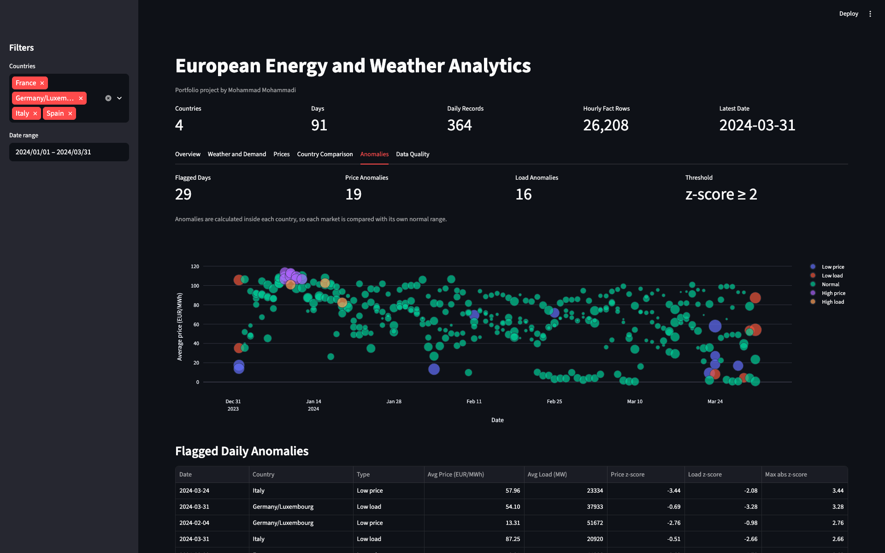
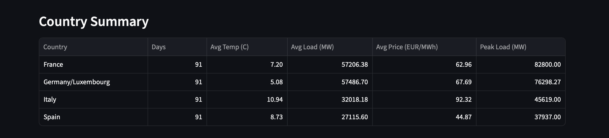

# European Energy and Weather Analytics Pipeline

Author: **Mohammad Mohammadi**

Status: **working MVP**

This is my end-to-end data engineering portfolio project. I built it to practice the parts of a real analytics pipeline that are usually missing from notebook-only projects: API extraction, cleaning, PostgreSQL storage, scheduled ETL logic, data validation, testing, Docker, and a dashboard.

The current version combines weather data from Open-Meteo with electricity load and day-ahead price data from ENTSO-E for Italy, France, Spain, and Germany/Luxembourg.

## What the Project Answers

The main question I am exploring is:

> How do weather conditions relate to electricity demand and electricity prices across selected European markets?

At this stage the project focuses on three months of hourly data from `2024-01-01` to `2024-03-31`. Renewable generation is still planned, so the current analysis is about weather, load, and prices.

## Current Results

The latest local run loaded:

- 4 countries: `IT`, `FR`, `ES`, `DE_LU`
- 8,736 hourly weather rows
- 8,736 hourly electricity load rows
- 8,736 hourly electricity price rows
- 26,208 total hourly fact rows
- 364 rows in the daily analytics mart
- 6 Streamlit dashboard tabs
- 14 automated tests

The full three-month pipeline run takes about 14 seconds on my laptop after Docker is running.

## Key Findings So Far

For the loaded period:

- Italy had the highest average day-ahead electricity price: `92.32 EUR/MWh`.
- Spain had the lowest average day-ahead electricity price: `44.87 EUR/MWh`.
- France and Germany/Luxembourg had the highest average electricity load, both above `57,000 MW`.
- France had the highest peak load in the dataset: `82,800 MW`.
- Temperature and load were negatively correlated in all four markets. The strongest relationship was in France, with a correlation of `-0.800`.

These results are based on the current sample period only. I do not treat them as general conclusions about the whole European energy market.

## Tech Stack

- Python
- PostgreSQL
- SQLAlchemy
- Pandas
- Prefect
- Streamlit
- Plotly
- Docker and Docker Compose
- pytest
- GitHub Actions

## Data Sources

- **Open-Meteo Historical Weather API** for hourly temperature, wind, humidity, precipitation, cloud cover, and shortwave radiation.
- **ENTSO-E Transparency Platform** for electricity load and day-ahead market prices.

Notes:

- ENTSO-E load data can be sub-hourly for some countries. I resample it to hourly averages before loading it.
- Italy day-ahead price data is queried from the `IT_NORD` bidding zone and stored under `IT` in this project.
- Eurostat and renewable generation data are not included yet.

## Architecture

```text
Open-Meteo API + ENTSO-E API
        |
        v
Python extraction code
        |
        v
Cleaning and validation
        |
        v
PostgreSQL fact tables
        |
        v
Daily analytics mart
        |
        v
Streamlit dashboard
        |
        v
pytest + GitHub Actions checks
```

## Repository Structure

```text
.
├── dashboard/
│   └── streamlit_app.py
├── data/
│   ├── processed/
│   └── raw/
├── docs/
│   ├── architecture.md
│   ├── data_dictionary.md
│   └── screenshots/
├── scripts/
├── sql/
│   ├── 01_schema.sql
│   └── 02_example_queries.sql
├── src/
│   ├── analysis/
│   ├── extract/
│   ├── load/
│   ├── pipeline/
│   ├── transform/
│   └── validation/
├── tests/
├── docker-compose.yml
├── Dockerfile
├── requirements.txt
└── README.md
```

## Database Model

The project uses PostgreSQL with dimension and fact tables:

- `dim_country`
- `dim_city`
- `fact_weather_hourly`
- `fact_energy_load_hourly`
- `fact_energy_price_hourly`
- `fact_generation_hourly`
- `mart_daily_country_energy_weather`

The dashboard reads from the daily mart for most analysis. The source fact tables are still available for row counts, coverage checks, and debugging.

## Pipeline Steps

The Prefect flow currently does the following:

1. Creates or updates the PostgreSQL schema.
2. Extracts hourly weather data from Open-Meteo.
3. Cleans weather fields and checks basic quality rules.
4. Loads weather rows into PostgreSQL.
5. If `INCLUDE_ENERGY=true`, extracts ENTSO-E load and price data.
6. Cleans and resamples ENTSO-E data.
7. Loads energy rows into PostgreSQL.
8. Refreshes the daily analytics mart.

## Dashboard

The Streamlit dashboard includes:

- overview metrics
- daily load and price trends
- weather vs demand analysis
- country comparison
- anomaly detection for unusual daily load and price values
- data quality and table coverage checks

Dashboard overview:



Anomaly detection tab:



Country summary table:



## Anomaly Detection

I added a simple anomaly detection layer on top of the daily analytics mart.

For each country, the project calculates z-scores for:

- daily average electricity price
- daily average electricity load

A day is flagged when the absolute z-score is at least `2`. This is not meant to be an advanced machine learning model. I chose it because it is easy to explain, works well for a first MVP, and gives recruiters a clear example of analytical logic added after the ETL pipeline.

## Testing and CI

The test suite covers:

- weather cleaning
- ENTSO-E load resampling
- price cleaning
- duplicate handling
- validation failures for bad/null data
- anomaly detection logic

GitHub Actions runs the tests automatically on each push to `main`.

Run the tests locally with:

```bash
docker compose run --rm dashboard python -m pytest tests
```

## How to Run Locally

Create a local environment file:

```bash
cp .env.example .env
```

Add your ENTSO-E token to `.env`:

```bash
ENTSOE_API_KEY=your_token_here
```

Start PostgreSQL and the dashboard:

```bash
docker compose up -d --build
```

Run the full pipeline:

```bash
docker compose exec -e INCLUDE_ENERGY=true dashboard python -m src.pipeline.prefect_flow
```

Open the dashboard:

```text
http://localhost:8501
```

## What Is Finished

- Open-Meteo weather extraction
- ENTSO-E load and price extraction
- PostgreSQL schema and fact tables
- Daily analytics mart
- Docker Compose setup
- Prefect pipeline
- Streamlit dashboard
- Data validation checks
- Anomaly detection
- pytest test suite
- GitHub Actions CI
- README documentation and dashboard screenshots

## Limitations and Next Steps

This is a working project, but it is not finished.

Next improvements I would make:

- Add renewable generation data from ENTSO-E.
- Add a small forecasting model after loading a longer time period.
- Add more robust data quality reports.
- Deploy a demo version of the dashboard online.
- Expand the dashboard screenshots after the anomaly tab is finalized.

## Resume Summary

Built a Dockerized energy and weather analytics pipeline using Python, PostgreSQL, Prefect, ENTSO-E, Open-Meteo, SQL, Streamlit, pytest, and GitHub Actions. The project loads 26,208 hourly fact rows for four European markets, builds a daily analytics mart, validates the data, detects simple price/load anomalies, and presents the results in an interactive dashboard.
